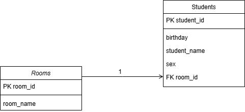

# Python Introduction Project

## 📋 Описание проекта

**Цель:**  
Разработать схему базы данных и Python-скрипты для загрузки и анализа данных о студентах и комнатах. Выполнить необходимые SQL-запросы, обработать и экспортировать результаты в JSON или XML формате.

**Задачи:**
- Спроектировать схему базы данных (например, MySQL или PostgreSQL) с отношением «многие к одному» (много студентов — одна комната).
- Написать скрипт для загрузки данных из двух файлов (студенты и комнаты) в базу данных.
- Реализовать 4 запроса:
  1. Список комнат и количество студентов в каждой.
  2. Пять комнат с наименьшим средним возрастом студентов.
  3. Пять комнат с наибольшей разницей в возрасте студентов.
  4. Список комнат, где живут студенты разных национальностей.

---

## ⚙️ Использование

### Инструкция по созданию БД

Файл **docker-compose.yml** содержит параметры для 

- запуска PostgreSQL в Docker-контейнере.
- открытия порта 5432 для подключения к базе.
- установки базы данных и пользователя.

####**Подключение** к серверу PosgreSQL 

psql -h localhost -p 5432 -U postgres

Создание новой базы данных с именем students_rooms:

CREATE DATABASE students_rooms;

Выход из psql:

\q

Файл **docker-compose.yml**

### Структура таблиц базы данных



### 📥 Ввод данных
Путь к исходным файлам (`students`, `rooms`) вводится через стандартную функцию `input()`.

### ▶️ Запуск запросов
Запросы разделены по модулям:

| Скрипт          | Описание запроса                                  |
|-----------------|----------------------------------------------------|
| `Query_1.py`    | Количество студентов в каждой комнате             |
| `Query_2.py`    | Комнаты с наименьшим средним возрастом            |
| `Query_3.py`    | Комнаты с наибольшей возрастной разницей          |
| `Query_4.py`    | Комнаты с разными национальностями студентов      |

Каждый из файлов запускает модуль `Query_init.py`, в котором пользователю предлагается выбрать формат экспорта: `XML` или `JSON`. В зависимости от выбора запускается модуль `Query_to_xml.py` или `Query_to_json.py`. Модуль 'DB_connection.py' устанавливает соединение с БД

---

## 🧠 Архитектура и принципы

- Все вычисления (средний возраст, разница возрастов и т.п.) выполняются средствами **SQL**.
- Используются **сырые SQL-запросы** — **ORM не применяется**.
- Придерживаемся принципов **SOLID** при построении архитектуры Python-кода.
- Результаты запросов сохраняются в XML или JSON файлы.
- Взаимодействие с пользователем через **терминал**.

---

## 📦 Формат данных

**Входные данные:**
- `students.json` — информация о студентах.
- `rooms.json` — информация о комнатах.

---

## 🔍 Оптимизация запросов

### Индексация
Для повышения производительности при выполнении запросов добавлены индексы по следующим полям:

```sql
CREATE INDEX idx_room_id ON students(room);
CREATE INDEX index_sex ON students USING HASH (sex)
Эти индексы ускоряют фильтрацию и агрегацию по ключевым полям, используемым в запросах.

🛠 Зависимости
Python 3.8+

PostgreSQL

Модули Python:

json

xml.etree.ElementTree

psycopg2


📁 Структура проекта
pgsql
Копировать
Редактировать
project/
│
├── Query_1.py
├── Query_2.py
├── Query_3.py
├── Query_4.py
├── Query_init.py
├── Query_to_json.py
├── Query_to_xml.py
├── Creating tables.py         # Загрузка данных в БД
├── DB_connection.py         # Настройки подключения к БД
├── data/
│   └── students.json
│   └── rooms.json
├── docker-compose.yml      # Инструкция по использованию PostgreSQL в Docker-контейнере. 
├── README.md
├── Explain_analyze.py      # Анализ планов выполнения запросов
└── explain_analyse.txt     # Планы выполнения запросов

